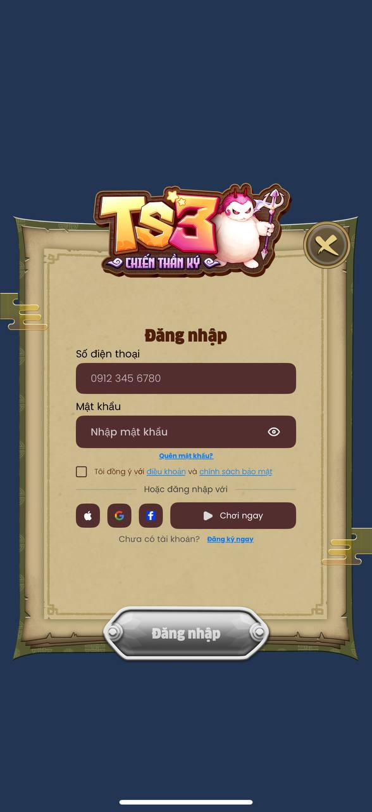

# Unity-iOS SwiftUI AuthSDK Integration Guide



# KKSoft iOS SDK - Unity Integration Guide

This guide explains how to integrate the KKSoft iOS SDK into a Unity-exported Xcode project using Swift Package Manager.

Swift Package URL:

```text
https://github.com/kksoftdeveloper/KKSoftiOSSDK.git
```

The SDK includes:

- Auth: SDK initialization, phone OTP registration, phone/password login, forgot password, Apple/Google/Facebook login, token refresh, logout, account deactivation, game server list, and game server switching.
- Account completion UI: required account information flow after login/register, including player phone verification and guardian phone verification by OTP.
- Payment/IAP: package list UI, backend package loading, StoreKit product fetching, purchase, and purchase verification.
- Tracking: AppFlyer, Firebase Analytics, Firebase Crashlytics, Adjust, TikTok, Meta, custom events, purchase events, screen events, user ID/properties, IDFV, and Adjust ID.

## 1. Requirements

- A Unity-exported iOS project.
- Xcode 15+.
- iOS deployment target 15.0+.
- Swift 5.9+.
- An Apple Developer account with the required capabilities enabled.

## 2. Add the SDK With Swift Package Manager

In the Xcode project exported from Unity:

1. Open `Unity-iPhone.xcodeproj`, or the workspace if your project uses CocoaPods.
2. Select the `Unity-iPhone` project.
3. Open `Package Dependencies`.
4. Click `+`.
5. Enter:

```text
https://github.com/kksoftdeveloper/KKSoftiOSSDK.git
```

6. Select Commit -> input Commit code: be7a121f50cd4deb3fd40421269d592036a79934
7. Add the `KKSoftiOSSDK` product to the `Unity-iPhone` target.
8. Make sure both `UnityFramework` and `Unity-iPhone` use iOS deployment target 15.0+.

If the build cannot find the module, check that:

- The `KKSoftiOSSDK` package product is linked to the `Unity-iPhone` target.
- The Swift bridge file below is also included in the `Unity-iPhone` target.
- The target contains at least one Swift file so Xcode generates the required Swift runtime settings.

## 3. Xcode And Info.plist Configuration

### App Environment (Optional)

`APP_ENV` is optional. Host apps do not need to add or manage this key for normal production integration.

Only add `APP_ENV` if you explicitly need to override the SDK environment, for example when testing against staging:

```xml
<key>APP_ENV</key>
<string>production</string>
```

or

<key>APP_ENV</key>
<string>staging</string>
```

If this key is missing, the SDK uses its default production environment.

### App Tracking Transparency

If you use AppFlyer, Adjust, TikTok, or Meta attribution, add:

```xml
<key>NSUserTrackingUsageDescription</key>
<string>This app requests tracking permission to measure advertising performance.</string>
```

### Sign in with Apple

In `Signing & Capabilities`, add:

```text
Sign In with Apple
```

### Google Sign-In

`GoogleService-Info.plist` is required when using Google Sign-In. Add it to the `Unity-iPhone` target before testing Google login.

Add the reversed client ID URL scheme to `CFBundleURLTypes`. Example:

```xml
<key>CFBundleURLTypes</key>
<array>
  <dict>
    <key>CFBundleURLSchemes</key>
    <array>
      <string>com.googleusercontent.apps.xxxxx</string>
    </array>
  </dict>
</array>
```

### Facebook Login / Meta

Add the Facebook keys for your app:

```xml
<key>FacebookAppID</key>
<string>YOUR_FACEBOOK_APP_ID</string>
<key>FacebookClientToken</key>
<string>YOUR_FACEBOOK_CLIENT_TOKEN</string>
<key>FacebookDisplayName</key>
<string>YOUR_APP_NAME</string>
<key>LSApplicationQueriesSchemes</key>
<array>
  <string>fbapi</string>
  <string>fb-messenger-share-api</string>
  <string>fbauth2</string>
  <string>fbshareextension</string>
</array>
```

Add the URL scheme:

```xml
<key>CFBundleURLTypes</key>
<array>
  <dict>
    <key>CFBundleURLSchemes</key>
    <array>
      <string>fbYOUR_FACEBOOK_APP_ID</string>
    </array>
  </dict>
</array>
```

### Firebase

If Firebase Analytics or Crashlytics is enabled:

- Make sure `GoogleService-Info.plist` is included in the `Unity-iPhone` target. This file is already required if Google Sign-In is enabled.
- Configure Crashlytics for the game's Firebase project.

### In-App Purchase

In `Signing & Capabilities`, add:

```text
In-App Purchase
```

On App Store Connect:

- Create product IDs that match the SKU values returned by the backend.
- Make sure products are approved or ready for testing according to Apple's IAP flow.

## 4. Native Swift Bridge for Unity

Unity C# cannot call Swift APIs directly. Create a Swift bridge in the exported Xcode project:

```text
Unity-iPhone/KKSoftUnityBridge.swift
```

Add this file to the `Unity-iPhone` target.

> Note: this is a reference bridge. You can split it into multiple files, add your own JSON schema, or use a Unity post-process script to copy it after every export.

```swift
import Foundation
import SwiftUI
import UIKit
import Combine
import StoreKit
import KKSoftiOSSDK

private final class KKSoftUnityBridge {
    static let shared = KKSoftUnityBridge()

    private var cancellables = Set<AnyCancellable>()
    private var authService: AuthServiceProvider?
    private var authManager: AuthManager?
    private var paymentManager: DefaultPaymentManager?
    private var trackingManager: TrackingManager?
    private weak var presentedViewController: UIViewController?

    private var packageName = ""
    private var appVersion = ""
    private var serverId = 0
    private var gameId = 0
    private var deviceId = UIDevice.current.identifierForVendor?.uuidString ?? ""

    private func unitySend(_ method: String, _ message: String) {
        "KKSoftSDK".withCString { objectName in
            method.withCString { methodName in
                message.withCString { payload in
                    UnitySendMessage(objectName, methodName, payload)
                }
            }
        }
    }

    private func topViewController(
        base: UIViewController? = UIApplication.shared.connectedScenes
            .compactMap { ($0 as? UIWindowScene)?.keyWindow }
            .first?.rootViewController
    ) -> UIViewController? {
        if let nav = base as? UINavigationController {
            return topViewController(base: nav.visibleViewController)
        }
        if let tab = base as? UITabBarController {
            return topViewController(base: tab.selectedViewController)
        }
        if let presented = base?.presentedViewController {
            return topViewController(base: presented)
        }
        return base
    }

    func configure(packageName: String, appVersion: String, serverId: Int, gameId: Int, deviceId: String?) {
        self.packageName = packageName
        self.appVersion = appVersion
        self.serverId = serverId
        self.gameId = gameId
        if let deviceId, !deviceId.isEmpty {
            self.deviceId = deviceId
        }

        let osVersion = UIDevice.current.systemVersion
        let service = AuthServiceProvider.Builder()
            .setAppVersion(appVersion)
            .setOSVersion(osVersion)
            .build()

        self.authService = service
        self.authManager = service.authManager

        service.authManager
            .initSDK(packageName: packageName, appVersion: appVersion, serverId: serverId)
            .receive(on: DispatchQueue.main)
            .sink { [weak self] completion in
                if case .failure(let error) = completion {
                    self?.unitySend("OnInitFailed", error.localizedDescription)
                }
            } receiveValue: { [weak self] _ in
                self?.unitySend("OnInitSuccess", "{}")
            }
            .store(in: &cancellables)
    }

    func showAuth() {
        guard let authManager else {
            unitySend("OnAuthFailed", "AuthManager is not configured")
            return
        }

        let view = WelcomeView(
            authManager: authManager,
            packageName: packageName,
            appVersionName: appVersion,
            serverId: serverId,
            onSuccess: { [weak self] session in
                self?.dismissPresented()
                self?.setupPayment(session: session)
                self?.unitySend("OnLoginSuccess", self?.encode(session) ?? "{}")
            },
            onRefreshedToken: { [weak self] session in
                self?.setupPayment(session: session)
                self?.unitySend("OnTokenRefreshed", self?.encode(session) ?? "{}")
            },
            onFailure: { [weak self] error in
                self?.unitySend("OnAuthFailed", error.message)
            },
            onClose: { [weak self] in
                self?.dismissPresented()
                self?.unitySend("OnAuthClosed", "{}")
            }
        )

        present(view)
    }

    func refreshToken() {
        guard let authManager else { return }
        authManager.refreshToken()
            .receive(on: DispatchQueue.main)
            .sink { [weak self] completion in
                if case .failure(let error) = completion {
                    self?.unitySend("OnTokenRefreshFailed", error.localizedDescription)
                }
            } receiveValue: { [weak self] session in
                self?.setupPayment(session: session)
                self?.unitySend("OnTokenRefreshed", self?.encode(session) ?? "{}")
            }
            .store(in: &cancellables)
    }

    func logout() {
        guard let authManager else { return }
        authManager.logout()
            .receive(on: DispatchQueue.main)
            .sink { [weak self] completion in
                if case .failure(let error) = completion {
                    self?.unitySend("OnLogoutFailed", error.localizedDescription)
                }
            } receiveValue: { [weak self] _ in
                self?.unitySend("OnLogoutSuccess", "{}")
            }
            .store(in: &cancellables)
    }

    func deactivateAccount() {
        guard let authManager else { return }
        authManager.deactivateAccount()
            .receive(on: DispatchQueue.main)
            .sink { [weak self] completion in
                if case .failure(let error) = completion {
                    self?.unitySend("OnDeactivateFailed", error.localizedDescription)
                }
            } receiveValue: { [weak self] _ in
                self?.unitySend("OnDeactivateSuccess", "{}")
            }
            .store(in: &cancellables)
    }

    func getGameServers() {
        guard let authManager else { return }
        authManager.getGameServerLists()
            .receive(on: DispatchQueue.main)
            .sink { [weak self] completion in
                if case .failure(let error) = completion {
                    self?.unitySend("OnGameServersFailed", error.localizedDescription)
                }
            } receiveValue: { [weak self] servers in
                self?.unitySend("OnGameServersSuccess", self?.encode(servers) ?? "[]")
            }
            .store(in: &cancellables)
    }

    func updateGameServer(serverId: Int) {
        guard let authManager else { return }
        authManager.getGameServerLists()
            .compactMap { servers in servers.first(where: { $0.serverId == serverId }) }
            .flatMap { authManager.updateGameServer(selectedGameServer: $0) }
            .receive(on: DispatchQueue.main)
            .sink { [weak self] completion in
                if case .failure(let error) = completion {
                    self?.unitySend("OnUpdateGameServerFailed", error.localizedDescription)
                }
            } receiveValue: { [weak self] gameUUID in
                self?.unitySend("OnUpdateGameServerSuccess", gameUUID)
            }
            .store(in: &cancellables)
    }

    private func setupPayment(session: AuthSessionResponse) {
        paymentManager = DefaultPaymentManager.Builder()
            .setDeviceId(deviceId)
            .setOSVersion(UIDevice.current.systemVersion)
            .setAccessToken(session.accessToken)
            .setRefreshToken(session.refreshToken)
            .setPhoneNumber(authManager?.getPhoneNumber() ?? "")
            .setAppVersion(appVersion)
            .setPackageName(packageName)
            .setGameId(gameId)
            .setServerId(session.serverId ?? serverId)
            .setGameUUID(session.gameUUID ?? "")
            .build()

        paymentManager?.initSDK()
            .receive(on: DispatchQueue.main)
            .sink { [weak self] completion in
                if case .failure(let error) = completion {
                    self?.unitySend("OnPaymentInitFailed", error.localizedDescription)
                }
            } receiveValue: { [weak self] _ in
                self?.unitySend("OnPaymentInitSuccess", "{}")
            }
            .store(in: &cancellables)
    }

    func showPackageList() {
        guard let authManager else { return }
        let view = PackageListView(
            onCloseClick: { [weak self] in self?.dismissPresented() },
            packageName: packageName,
            gameId: gameId,
            deviceId: deviceId,
            osVersion: UIDevice.current.systemVersion,
            accessToken: "",
            refreshToken: "",
            phoneNumber: authManager.getPhoneNumber(),
            appVersion: appVersion,
            serverId: authManager.getServerId() ?? serverId,
            gameUUID: ""
        )
        present(view)
    }

    func fetchPackages(size: Int, page: Int) {
        guard let paymentManager else { return }
        paymentManager.fetchGamePackages(gameId: gameId, serverId: serverId, size: size, page: page)
            .receive(on: DispatchQueue.main)
            .sink { [weak self] completion in
                if case .failure(let error) = completion {
                    self?.unitySend("OnFetchPackagesFailed", "\(error)")
                }
            } receiveValue: { [weak self] packages in
                self?.unitySend("OnFetchPackagesSuccess", self?.encode(packages) ?? "[]")
            }
            .store(in: &cancellables)
    }

    func purchase(productId: String) {
        guard let paymentManager else { return }
        paymentManager.purchase(productId: productId)
            .receive(on: DispatchQueue.main)
            .sink { [weak self] completion in
                if case .failure(let error) = completion {
                    self?.unitySend("OnPurchaseFailed", self?.encode(error) ?? error.message)
                }
            } receiveValue: { [weak self] result in
                self?.unitySend("OnPurchaseSuccess", self?.encode(result) ?? "{}")
            }
            .store(in: &cancellables)
    }

    func configureTracking(
        appFlyerAppId: String?,
        appFlyerDevKey: String?,
        firebaseAppId: String?,
        adjustAppId: String?,
        adjustToken: String?,
        tikTokAccessToken: String?,
        tikTokAppId: String?,
        tikTokBusinessAppId: String?,
        metaAppId: String?,
        metaClientToken: String?
    ) {
        let builder = TrackingServiceProvider.Builder()

        if let appFlyerAppId, let appFlyerDevKey {
            _ = builder.enableAppFlyers(appID: appFlyerAppId, devKey: appFlyerDevKey)
        }
        if let firebaseAppId {
            _ = builder.enableFirebaseAnalytics(appID: firebaseAppId)
            _ = builder.enableFirebaseCrashlytics()
        }
        if let adjustAppId, let adjustToken {
            _ = builder.enableAdjust(appID: adjustAppId, appToken: adjustToken)
        }
        if let tikTokAccessToken, let tikTokAppId, let tikTokBusinessAppId {
            _ = builder.enableTikTok(accessToken: tikTokAccessToken, appID: tikTokAppId, tiktokAppID: tikTokBusinessAppId)
        }
        if let metaAppId, let metaClientToken {
            _ = builder.enableMeta(appID: metaAppId, clientToken: metaClientToken)
        }

        trackingManager = builder.build().trackingManager
        trackingManager?.initialize()
        unitySend("OnTrackingInitSuccess", "{}")
    }

    func trackEvent(name: String, json: String?) {
        trackingManager?.trackEvent(name, parameters: parseJson(json))
    }

    func trackScreen(name: String, json: String?) {
        trackingManager?.trackScreen(name, parameters: parseJson(json))
    }

    func trackPurchase(productId: String, price: Double, currency: String, json: String?) {
        trackingManager?.trackPurchase(productID: productId, price: price, currency: currency, parameters: parseJson(json))
    }

    func setUserId(_ userId: String) {
        trackingManager?.setUserID(userId)
    }

    func setUserProperties(_ json: String?) {
        trackingManager?.setUserProperties(parseJson(json) ?? [:])
    }

    func getTrackingIds() {
        let idfv = trackingManager?.getIDFV() ?? ""
        trackingManager?.getAdjustId { [weak self] adjustId in
            let payload = "{\"idfv\":\"\(idfv)\",\"adjustId\":\"\(adjustId ?? "")\"}"
            self?.unitySend("OnTrackingIds", payload)
        }
    }

    private func present<V: View>(_ view: V) {
        DispatchQueue.main.async {
            let controller = UIHostingController(rootView: view)
            controller.modalPresentationStyle = .overFullScreen
            controller.view.backgroundColor = .clear
            self.presentedViewController = controller
            self.topViewController()?.present(controller, animated: true)
        }
    }

    private func dismissPresented() {
        DispatchQueue.main.async {
            self.presentedViewController?.dismiss(animated: true)
            self.presentedViewController = nil
        }
    }

    private func parseJson(_ json: String?) -> [String: Any]? {
        guard let json, let data = json.data(using: .utf8) else { return nil }
        return (try? JSONSerialization.jsonObject(with: data)) as? [String: Any]
    }

    private func encode<T: Encodable>(_ value: T) -> String {
        guard
            let data = try? JSONEncoder().encode(value),
            let json = String(data: data, encoding: .utf8)
        else { return "{}" }
        return json
    }
}
```

Add the `UnitySendMessage` declaration and C exports to the same file:

```swift
@_silgen_name("UnitySendMessage")
func UnitySendMessage(_ objectName: UnsafePointer<CChar>, _ methodName: UnsafePointer<CChar>, _ message: UnsafePointer<CChar>)

private func str(_ ptr: UnsafePointer<CChar>?) -> String {
    guard let ptr else { return "" }
    return String(cString: ptr)
}

@_cdecl("KKSoft_Configure")
public func KKSoft_Configure(
    _ packageName: UnsafePointer<CChar>,
    _ appVersion: UnsafePointer<CChar>,
    _ serverId: Int32,
    _ gameId: Int32,
    _ deviceId: UnsafePointer<CChar>?
) {
    KKSoftUnityBridge.shared.configure(
        packageName: str(packageName),
        appVersion: str(appVersion),
        serverId: Int(serverId),
        gameId: Int(gameId),
        deviceId: deviceId.map(str)
    )
}

@_cdecl("KKSoft_ShowAuth")
public func KKSoft_ShowAuth() {
    KKSoftUnityBridge.shared.showAuth()
}

@_cdecl("KKSoft_RefreshToken")
public func KKSoft_RefreshToken() {
    KKSoftUnityBridge.shared.refreshToken()
}

@_cdecl("KKSoft_Logout")
public func KKSoft_Logout() {
    KKSoftUnityBridge.shared.logout()
}

@_cdecl("KKSoft_DeactivateAccount")
public func KKSoft_DeactivateAccount() {
    KKSoftUnityBridge.shared.deactivateAccount()
}

@_cdecl("KKSoft_GetGameServers")
public func KKSoft_GetGameServers() {
    KKSoftUnityBridge.shared.getGameServers()
}

@_cdecl("KKSoft_UpdateGameServer")
public func KKSoft_UpdateGameServer(_ serverId: Int32) {
    KKSoftUnityBridge.shared.updateGameServer(serverId: Int(serverId))
}

@_cdecl("KKSoft_ShowPackageList")
public func KKSoft_ShowPackageList() {
    KKSoftUnityBridge.shared.showPackageList()
}

@_cdecl("KKSoft_FetchPackages")
public func KKSoft_FetchPackages(_ size: Int32, _ page: Int32) {
    KKSoftUnityBridge.shared.fetchPackages(size: Int(size), page: Int(page))
}

@_cdecl("KKSoft_Purchase")
public func KKSoft_Purchase(_ productId: UnsafePointer<CChar>) {
    KKSoftUnityBridge.shared.purchase(productId: str(productId))
}

@_cdecl("KKSoft_ConfigureTracking")
public func KKSoft_ConfigureTracking(
    _ appFlyerAppId: UnsafePointer<CChar>?,
    _ appFlyerDevKey: UnsafePointer<CChar>?,
    _ firebaseAppId: UnsafePointer<CChar>?,
    _ adjustAppId: UnsafePointer<CChar>?,
    _ adjustToken: UnsafePointer<CChar>?,
    _ tikTokAccessToken: UnsafePointer<CChar>?,
    _ tikTokAppId: UnsafePointer<CChar>?,
    _ tikTokBusinessAppId: UnsafePointer<CChar>?,
    _ metaAppId: UnsafePointer<CChar>?,
    _ metaClientToken: UnsafePointer<CChar>?
) {
    KKSoftUnityBridge.shared.configureTracking(
        appFlyerAppId: appFlyerAppId.map(str),
        appFlyerDevKey: appFlyerDevKey.map(str),
        firebaseAppId: firebaseAppId.map(str),
        adjustAppId: adjustAppId.map(str),
        adjustToken: adjustToken.map(str),
        tikTokAccessToken: tikTokAccessToken.map(str),
        tikTokAppId: tikTokAppId.map(str),
        tikTokBusinessAppId: tikTokBusinessAppId.map(str),
        metaAppId: metaAppId.map(str),
        metaClientToken: metaClientToken.map(str)
    )
}

@_cdecl("KKSoft_TrackEvent")
public func KKSoft_TrackEvent(_ name: UnsafePointer<CChar>, _ json: UnsafePointer<CChar>?) {
    KKSoftUnityBridge.shared.trackEvent(name: str(name), json: json.map(str))
}

@_cdecl("KKSoft_TrackScreen")
public func KKSoft_TrackScreen(_ name: UnsafePointer<CChar>, _ json: UnsafePointer<CChar>?) {
    KKSoftUnityBridge.shared.trackScreen(name: str(name), json: json.map(str))
}

@_cdecl("KKSoft_TrackPurchase")
public func KKSoft_TrackPurchase(
    _ productId: UnsafePointer<CChar>,
    _ price: Double,
    _ currency: UnsafePointer<CChar>,
    _ json: UnsafePointer<CChar>?
) {
    KKSoftUnityBridge.shared.trackPurchase(productId: str(productId), price: price, currency: str(currency), json: json.map(str))
}

@_cdecl("KKSoft_SetUserId")
public func KKSoft_SetUserId(_ userId: UnsafePointer<CChar>) {
    KKSoftUnityBridge.shared.setUserId(str(userId))
}

@_cdecl("KKSoft_SetUserProperties")
public func KKSoft_SetUserProperties(_ json: UnsafePointer<CChar>?) {
    KKSoftUnityBridge.shared.setUserProperties(json.map(str))
}

@_cdecl("KKSoft_GetTrackingIds")
public func KKSoft_GetTrackingIds() {
    KKSoftUnityBridge.shared.getTrackingIds()
}
```

## 5. Unity C# Wrapper

Create:

```text
Assets/Scripts/KKSoftSDK.cs
```

A GameObject named `KKSoftSDK` must exist in the first scene because the native bridge sends callbacks through `UnitySendMessage("KKSoftSDK", ...)`.

```csharp
using System;
using System.Runtime.InteropServices;
using UnityEngine;

public sealed class KKSoftSDK : MonoBehaviour
{
    public static KKSoftSDK Instance { get; private set; }

#if UNITY_IOS && !UNITY_EDITOR
    [DllImport("__Internal")] private static extern void KKSoft_Configure(string packageName, string appVersion, int serverId, int gameId, string deviceId);
    [DllImport("__Internal")] private static extern void KKSoft_ShowAuth();
    [DllImport("__Internal")] private static extern void KKSoft_RefreshToken();
    [DllImport("__Internal")] private static extern void KKSoft_Logout();
    [DllImport("__Internal")] private static extern void KKSoft_DeactivateAccount();
    [DllImport("__Internal")] private static extern void KKSoft_GetGameServers();
    [DllImport("__Internal")] private static extern void KKSoft_UpdateGameServer(int serverId);
    [DllImport("__Internal")] private static extern void KKSoft_ShowPackageList();
    [DllImport("__Internal")] private static extern void KKSoft_FetchPackages(int size, int page);
    [DllImport("__Internal")] private static extern void KKSoft_Purchase(string productId);
    [DllImport("__Internal")] private static extern void KKSoft_ConfigureTracking(
        string appFlyerAppId,
        string appFlyerDevKey,
        string firebaseAppId,
        string adjustAppId,
        string adjustToken,
        string tikTokAccessToken,
        string tikTokAppId,
        string tikTokBusinessAppId,
        string metaAppId,
        string metaClientToken
    );
    [DllImport("__Internal")] private static extern void KKSoft_TrackEvent(string name, string json);
    [DllImport("__Internal")] private static extern void KKSoft_TrackScreen(string name, string json);
    [DllImport("__Internal")] private static extern void KKSoft_TrackPurchase(string productId, double price, string currency, string json);
    [DllImport("__Internal")] private static extern void KKSoft_SetUserId(string userId);
    [DllImport("__Internal")] private static extern void KKSoft_SetUserProperties(string json);
    [DllImport("__Internal")] private static extern void KKSoft_GetTrackingIds();
#endif

    private void Awake()
    {
        if (Instance != null)
        {
            Destroy(gameObject);
            return;
        }
        Instance = this;
        DontDestroyOnLoad(gameObject);
    }

    public void Configure(string packageName, string appVersion, int serverId, int gameId, string deviceId = "")
    {
#if UNITY_IOS && !UNITY_EDITOR
        KKSoft_Configure(packageName, appVersion, serverId, gameId, deviceId);
#endif
    }

    public void ShowAuth()
    {
#if UNITY_IOS && !UNITY_EDITOR
        KKSoft_ShowAuth();
#endif
    }

    public void RefreshToken()
    {
#if UNITY_IOS && !UNITY_EDITOR
        KKSoft_RefreshToken();
#endif
    }

    public void Logout()
    {
#if UNITY_IOS && !UNITY_EDITOR
        KKSoft_Logout();
#endif
    }

    public void DeactivateAccount()
    {
#if UNITY_IOS && !UNITY_EDITOR
        KKSoft_DeactivateAccount();
#endif
    }

    public void GetGameServers()
    {
#if UNITY_IOS && !UNITY_EDITOR
        KKSoft_GetGameServers();
#endif
    }

    public void UpdateGameServer(int serverId)
    {
#if UNITY_IOS && !UNITY_EDITOR
        KKSoft_UpdateGameServer(serverId);
#endif
    }

    public void ShowPackageList()
    {
#if UNITY_IOS && !UNITY_EDITOR
        KKSoft_ShowPackageList();
#endif
    }

    public void FetchPackages(int size = 20, int page = 0)
    {
#if UNITY_IOS && !UNITY_EDITOR
        KKSoft_FetchPackages(size, page);
#endif
    }

    public void Purchase(string productId)
    {
#if UNITY_IOS && !UNITY_EDITOR
        KKSoft_Purchase(productId);
#endif
    }

    public void ConfigureTracking(
        string appFlyerAppId = null,
        string appFlyerDevKey = null,
        string firebaseAppId = null,
        string adjustAppId = null,
        string adjustToken = null,
        string tikTokAccessToken = null,
        string tikTokAppId = null,
        string tikTokBusinessAppId = null,
        string metaAppId = null,
        string metaClientToken = null)
    {
#if UNITY_IOS && !UNITY_EDITOR
        KKSoft_ConfigureTracking(appFlyerAppId, appFlyerDevKey, firebaseAppId, adjustAppId, adjustToken, tikTokAccessToken, tikTokAppId, tikTokBusinessAppId, metaAppId, metaClientToken);
#endif
    }

    public void TrackEvent(string name, string json = "{}")
    {
#if UNITY_IOS && !UNITY_EDITOR
        KKSoft_TrackEvent(name, json);
#endif
    }

    public void TrackScreen(string screenName, string json = "{}")
    {
#if UNITY_IOS && !UNITY_EDITOR
        KKSoft_TrackScreen(screenName, json);
#endif
    }

    public void TrackPurchase(string productId, double price, string currency, string json = "{}")
    {
#if UNITY_IOS && !UNITY_EDITOR
        KKSoft_TrackPurchase(productId, price, currency, json);
#endif
    }

    public void SetUserId(string userId)
    {
#if UNITY_IOS && !UNITY_EDITOR
        KKSoft_SetUserId(userId);
#endif
    }

    public void SetUserProperties(string json)
    {
#if UNITY_IOS && !UNITY_EDITOR
        KKSoft_SetUserProperties(json);
#endif
    }

    public void GetTrackingIds()
    {
#if UNITY_IOS && !UNITY_EDITOR
        KKSoft_GetTrackingIds();
#endif
    }

    // Native callbacks
    public void OnInitSuccess(string json) => Debug.Log("[KKSoft] Init success: " + json);
    public void OnInitFailed(string message) => Debug.LogError("[KKSoft] Init failed: " + message);
    public void OnAuthClosed(string json) => Debug.Log("[KKSoft] Auth closed");
    public void OnAuthFailed(string message) => Debug.LogError("[KKSoft] Auth failed: " + message);
    public void OnLoginSuccess(string json) => Debug.Log("[KKSoft] Login success: " + json);
    public void OnTokenRefreshed(string json) => Debug.Log("[KKSoft] Token refreshed: " + json);
    public void OnTokenRefreshFailed(string message) => Debug.LogError("[KKSoft] Token refresh failed: " + message);
    public void OnLogoutSuccess(string json) => Debug.Log("[KKSoft] Logout success");
    public void OnLogoutFailed(string message) => Debug.LogError("[KKSoft] Logout failed: " + message);
    public void OnDeactivateSuccess(string json) => Debug.Log("[KKSoft] Deactivate success");
    public void OnDeactivateFailed(string message) => Debug.LogError("[KKSoft] Deactivate failed: " + message);
    public void OnGameServersSuccess(string json) => Debug.Log("[KKSoft] Servers: " + json);
    public void OnGameServersFailed(string message) => Debug.LogError("[KKSoft] Servers failed: " + message);
    public void OnUpdateGameServerSuccess(string gameUUID) => Debug.Log("[KKSoft] Update server success: " + gameUUID);
    public void OnUpdateGameServerFailed(string message) => Debug.LogError("[KKSoft] Update server failed: " + message);
    public void OnPaymentInitSuccess(string json) => Debug.Log("[KKSoft] Payment init success");
    public void OnPaymentInitFailed(string message) => Debug.LogError("[KKSoft] Payment init failed: " + message);
    public void OnFetchPackagesSuccess(string json) => Debug.Log("[KKSoft] Packages: " + json);
    public void OnFetchPackagesFailed(string message) => Debug.LogError("[KKSoft] Fetch packages failed: " + message);
    public void OnPurchaseSuccess(string json) => Debug.Log("[KKSoft] Purchase success: " + json);
    public void OnPurchaseFailed(string message) => Debug.LogError("[KKSoft] Purchase failed: " + message);
    public void OnTrackingInitSuccess(string json) => Debug.Log("[KKSoft] Tracking init success");
    public void OnTrackingIds(string json) => Debug.Log("[KKSoft] Tracking IDs: " + json);
}
```

## 6. Call the SDK From Unity

Create a GameObject in the first scene:

```text
KKSoftSDK
```

Attach the `KKSoftSDK` component.

Initialization example:

```csharp
public class Bootstrap : MonoBehaviour
{
    private void Start()
    {
        KKSoftSDK.Instance.Configure(
            packageName: Application.identifier,
            appVersion: Application.version,
            serverId: 1,
            gameId: 1,
            deviceId: SystemInfo.deviceUniqueIdentifier
        );

        KKSoftSDK.Instance.ConfigureTracking(
            appFlyerAppId: "YOUR_APPSTORE_ID",
            appFlyerDevKey: "YOUR_APPSFLYER_DEV_KEY",
            firebaseAppId: "YOUR_FIREBASE_APP_ID",
            adjustAppId: "YOUR_ADJUST_APP_ID",
            adjustToken: "YOUR_ADJUST_TOKEN",
            tikTokAccessToken: "YOUR_TIKTOK_ACCESS_TOKEN",
            tikTokAppId: "YOUR_IOS_BUNDLE_ID",
            tikTokBusinessAppId: "YOUR_TIKTOK_APP_ID",
            metaAppId: "YOUR_META_APP_ID",
            metaClientToken: "YOUR_META_CLIENT_TOKEN"
        );
    }
}
```

Open the Auth screen:

```csharp
KKSoftSDK.Instance.ShowAuth();
```

Get the server list and switch server:

```csharp
KKSoftSDK.Instance.GetGameServers();
KKSoftSDK.Instance.UpdateGameServer(22);
```

Open the package purchase UI:

```csharp
KKSoftSDK.Instance.ShowPackageList();
```

Purchase directly by product ID:

```csharp
KKSoftSDK.Instance.Purchase("com.company.game.pack_001");
```

`OnPurchaseSuccess` is sent only after the SDK completes StoreKit purchase and backend purchase verification. StoreKit failures, user cancellation, or backend verification failures are returned through `OnPurchaseFailed`.

Tracking:

```csharp
KKSoftSDK.Instance.TrackScreen("Home");
KKSoftSDK.Instance.TrackEvent("level_start", "{\"level\":1}");
KKSoftSDK.Instance.TrackPurchase("pack_001", 0.99, "USD", "{\"source\":\"shop\"}");
KKSoftSDK.Instance.SetUserId("game-uuid-or-character-id");
KKSoftSDK.Instance.SetUserProperties("{\"server\":\"S1\",\"level\":10}");
KKSoftSDK.Instance.GetTrackingIds();
```

Logout/deactivate:

```csharp
KKSoftSDK.Instance.Logout();
KKSoftSDK.Instance.DeactivateAccount();
```

## 7. Current Auth Flow

The SDK `WelcomeView` handles:

- Login phone/password.
- Login Apple/Google/Facebook.
- Phone OTP registration.
- Forgot password by phone OTP.
- If the user is missing required information after login: shows the required-information popup, verifies player phone or guardian phone by OTP, then returns `OnLoginSuccess` to Unity.
- The close button on each step returns to the screen that opened the flow.
- Tapping outside an input hides the keyboard.

## 8. Current Payment Flow

There are two integration options:

- `ShowPackageList()`: show the SDK package list UI. The SDK loads packages and handles purchase.
- `FetchPackages()` + `Purchase(productId)`: Unity renders its own shop UI, while the SDK handles StoreKit purchase and backend verification.

After login succeeds, the reference bridge calls `setupPayment(session:)` so Payment SDK receives token, game info, and player info.

## 9. Unity Post-process Automation

Unity may overwrite the Xcode project on every export. Create a `PostProcessBuild` script to:

- Add the Swift bridge file to the Xcode project.
- Add Swift Package dependency `https://github.com/kksoftdeveloper/KKSoftiOSSDK.git`, select Commit, input: afe63641f596d16d651c529e5bf62ea68ced3379
- Link the `KKSoftiOSSDK` product to the `Unity-iPhone` target.
- Set iOS deployment target 15.0.
- Add capabilities: Sign In with Apple, In-App Purchase.
- Merge Info.plist keys for Google, Facebook, ATT, and Firebase.

If you do not have a post-process script yet, configure Xcode manually first, then automate once the integration is stable.

## 10. Pre-Submit/TestFlight Checklist

- `KKSoftiOSSDK` has been added through Swift Package Manager to the `Unity-iPhone` target.
- `KKSoftUnityBridge.swift` is included in the `Unity-iPhone` target.
- `Assets/Scripts/KKSoftSDK.cs` is attached to a GameObject named exactly `KKSoftSDK`.
- Optional: `APP_ENV` is set only when the host app intentionally overrides the SDK environment, such as staging builds.
- `GoogleService-Info.plist` is included in the `Unity-iPhone` target if Google Sign-In is used.
- Google URL scheme uses the correct reversed client ID.
- Facebook App ID, client token, and URL scheme are correct.
- Sign in with Apple is enabled if Apple login is used.
- In-App Purchase is enabled if Payment is used.
- Product IDs on App Store Connect match backend SKUs.
- `NSUserTrackingUsageDescription` exists if tracking attribution is used.
- Firebase configuration is complete if Firebase Analytics or Crashlytics is enabled.
- Test on a real device, not only on Simulator, because Apple login, IAP, and tracking have Simulator limitations.

## 11. Troubleshooting

### `No such module 'KKSoftiOSSDK'`

- The package product is not linked to the `Unity-iPhone` target.
- The Swift bridge file is not included in the `Unity-iPhone` target.
- Clean the build folder and resolve packages again.

### Unity does not receive callbacks

- The scene must contain a GameObject named exactly `KKSoftSDK`.
- C# callback methods must be public instance methods.
- The native bridge calls `UnitySendMessage("KKSoftSDK", method, message)`.

### Google/Facebook login does not return to the app

- Check URL schemes in `Info.plist`.
- Check Bundle ID and app configuration in the Google/Facebook console.

### IAP cannot fetch products

- Product IDs in Unity/backend must match App Store Connect.
- The In-App Purchase capability must be enabled.
- Test with a sandbox Apple ID on a real device.

### Tracking has no IDFA/attribution

- Add `NSUserTrackingUsageDescription`.
- Initialize tracking early in the app lifecycle.
- Test the ATT prompt on a real device.

## 12. Update the SDK:
In Xcode, select Project → Package Dependencies, input new Commit, then Enter. 

